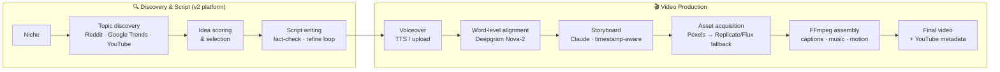

# Content Factory

[](https://github.com/gobokobok/content-factory-saas/actions/workflows/ci.yml)
[](https://www.python.org/downloads/release/python-3110/)
[](https://fastapi.tiangolo.com/)
[](https://langchain-ai.github.io/langgraph/)

**An automated AI video production pipeline.** Give it a niche; it discovers trending topics, writes and fact-checks a script, generates a voiceover, storyboards every scene against real word-level timestamps, acquires matching footage, and renders a finished vertical video — with a human approval gate at each editorial decision.

Built as the production system behind a data-driven YouTube Shorts channel, and run daily in production on Railway.

## Pipeline



Every artifact (script, storyboard, asset manifest, render) is written to **Cloudflare R2** and indexed in **Postgres**, so any step can be inspected, retried, or resumed. The operator drives the pipeline from a zero-framework HTML/JS **Studio UI** or via a **Telegram bot** interface.

## Highlights

- **LangGraph orchestration with durable checkpoints** — workers are pure, stateless graph nodes; state carries only artifact references and typed control signals. Loop bounds and routing live on graph edges, never inside workers. Every execution records `worker_version + prompt_version + model + sampling params` for full reproducibility.
- **27 specialized workers** — topic discovery, opportunity scoring, hook generation/selection, script writing with a bounded fact-check → patch → re-score refinement loop, narrative lens, storyboard generation, visual direction, asset acquisition, render, YouTube metadata.
- **Timestamp-grounded storyboards** — Deepgram word-level alignment feeds the storyboard prompt, so scene cuts land on real speech boundaries, not estimates.
- **Resilient asset acquisition** — stock footage search (Pexels) with semantic re-ranking (sentence-transformers), falling back to AI image generation (Replicate/Flux) per scene; partial failures degrade gracefully instead of failing the run.
- **Human-in-the-loop gates** — the graph pauses at editorial checkpoints (topic choice, script approval, asset review) and resumes from the Postgres checkpointer when the operator decides.
- **Disciplined delivery** — 93 test files in CI, two-environment deploys (push → DEV, git tag → PROD), 65+ logged architecture decisions, every function docstringed, no hardcoded config.

## Repository layout

| Path | What it is |
|------|-----------|
| `cf_platform/` | **v2 platform** — LangGraph workers, stage graphs, orchestrator, Postgres metadata index, Telegram interface |
| `src/` | **v1 pipeline** — shipped first, still serving production video assembly; reached from v2 only through a one-way adapter (`cf_platform/adapters/legacy_video.py`) |
| `tests/` | Unit + route tests for both layers, run in CI on every push |
| `docs/` | Architecture, migration plan, prompt engineering log, testing strategy |
| `tools/` | Standalone browser tools (no server required) |

The two-codebase layout is deliberate: v1 shipped and stayed stable while the v2 platform is being built alongside it, migrating one stage at a time — the strangler-fig pattern. The full migration spec lives in [docs/v2_platform_plan.md](docs/v2_platform_plan.md).

## How this was built

This project is developed solo with AI-assisted tooling under an explicit engineering methodology — every architectural choice is written down before code:

- [DECISIONS.md](DECISIONS.md) — 65+ numbered architecture & dependency decisions (ADR-style), including reversals and their reasons
- [METHODOLOGY.md](METHODOLOGY.md) — the sprint workflow: story-driven development, definition of done, human-touchpoint rule
- [CONVENTIONS.md](CONVENTIONS.md) — enforced Python standards (pure async step functions, thin routes, typed contracts)
- [docs/PROMPTS.md](docs/PROMPTS.md) — versioned prompt-engineering changelog (storyboard prompt is at v0.16+, each revision motivated by observed failures)
- [docs/ARCHITECTURE.md](docs/ARCHITECTURE.md) — current state, migration path, and target architecture

## Stack

**FastAPI** (async Python 3.11) · **LangGraph** + Postgres checkpointer · **Claude API** (script, storyboard, metadata) · **Deepgram** (forced alignment) · **Pexels / Replicate** (assets) · **FFmpeg** (assembly) · **Cloudflare R2** (artifact store) · **Railway** (deploy) · plain HTML/JS operator UI — no frontend framework by design.

## Running locally

```bash
bash scripts/bootstrap.sh          # venv + dependencies + .env.local template
source .venv/bin/activate
# fill in .env.local — see ENV.md for every variable
uvicorn src.main:app --reload
```

Health check: `curl http://localhost:8000/health` · Studio UI: `http://localhost:8000/`

Requires API keys for Anthropic, Pexels, Replicate, Freesound, plus Cloudflare R2 credentials. A Postgres `DATABASE_URL` enables the v2 platform features; without it the legacy pipeline still runs (fault isolation is a design rule — see D048).

## Deployment

| Trigger | Environment |
|---------|-------------|
| Push to `main` | DEV — Railway auto-deploy |
| Git tag `v*.*.*` | PROD — GitHub Actions → Railway (`scripts/promote.sh`) |

CI runs the full non-integration test suite on every push; PROD only ever deploys a tagged commit.
